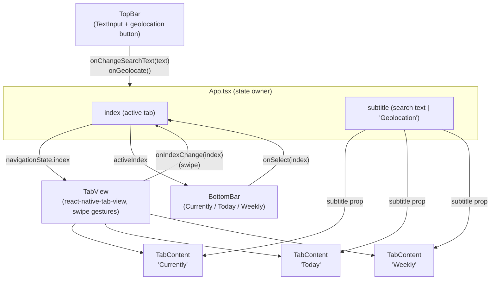

# weather_app — Module01: Structure and Logic

Turn-in for `mobileModule01`. Covers both exercises against a single evolving project:

- **ex00 — BottomBar**: 3-tab navigation (Currently / Today / Weekly), switchable by tap or swipe. *(implemented)*
- **ex01 — TopBar**: search `TextField` + geolocation button, whose value is shown on every tab. *(being rewritten by hand for practice — not wired into `App.tsx` yet)*

## Directory tree

```
weather_app/
├── App.tsx                 # root: owns tab index (+ search/geo state once ex01 is back), composes TopBar/TabView/BottomBar
├── components/
│   ├── BottomBar.tsx        # ex00 — 3 tappable tabs w/ icon + label, highlights active tab
│   └── TopBar.tsx           # ex01 — search TextInput + geolocation button (WIP, being rewritten)
├── screens/
│   └── TabContent.tsx        # dumb view: renders "{tabName}" + optional "{subtitle}"
├── assets/                   # app icons / splash (expo template defaults)
├── app.json                  # Expo config
├── package.json / package-lock.json
├── tsconfig.json              # extends expo/tsconfig.base, strict: true
└── index.ts                    # Expo entry point (registers App)
```

## Component responsibilities

| File | Owns | Talks to |
|---|---|---|
| `App.tsx` | `index` (active tab), `searchText`/`subtitle` (ex01) | renders `TopBar`, `TabView`, `BottomBar`; passes `subtitle` down into each `TabContent` |
| `components/TopBar.tsx` | local geolocation permission call | reports up via `onChangeSearchText` / `onGeolocate` callbacks — **no state of its own** |
| `components/BottomBar.tsx` | nothing (controlled) | reports taps via `onSelect(index)` — driven entirely by `activeIndex` prop from `App.tsx` |
| `screens/TabContent.tsx` | nothing | pure presentational: `{ tabName, subtitle }` in, text out |

State lives in one place (`App.tsx`) and flows down; `TopBar`/`BottomBar`/`TabContent` are all controlled components that only report events up. This keeps the 3 tabs trivially in sync with both the search bar and the bottom tab bar.

## Data flow



## Key decisions

- **Swipe + tap in sync**: `react-native-tab-view`'s `TabView` already handles swipe gestures via `react-native-pager-view`. Its built-in tab bar is disabled (`renderTabBar={() => null}`) and replaced with our own `BottomBar`, both driven by the same `index` state in `App.tsx` — tapping calls `setIndex` directly, swiping calls it via `onIndexChange`.
- **One subtitle, three tabs**: rather than each tab tracking its own copy of the search text, `App.tsx` holds a single `subtitle` string and passes it to all three `TabContent` instances, so the spec's "tab name + entered text in **all** tabs" falls out naturally.
- **Stack**: Expo/React Native (matches Module00), not Flutter — the subject's Flutter hints are non-binding examples per the subject's own instructions.
